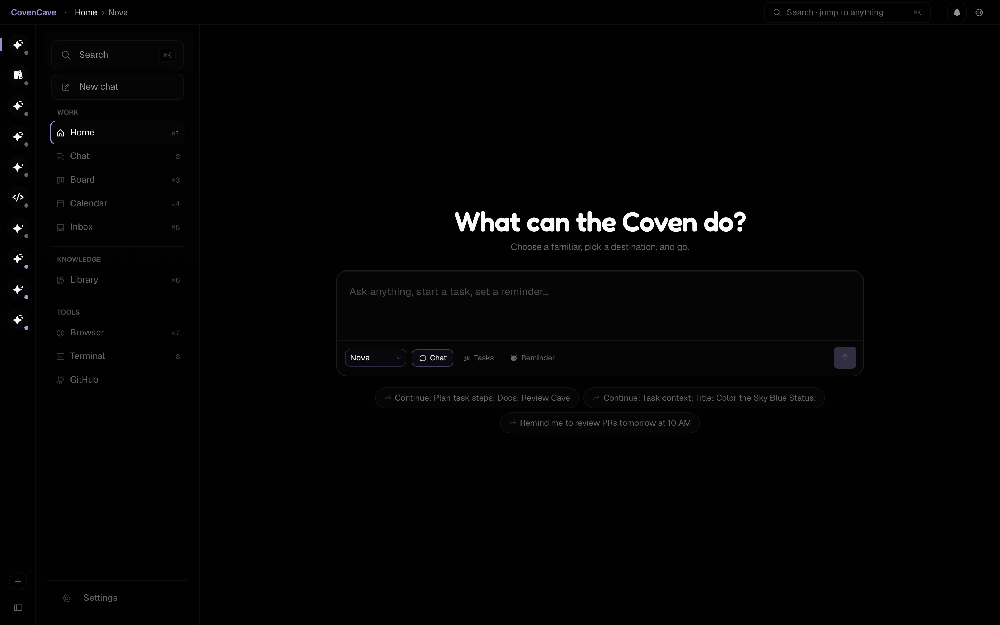
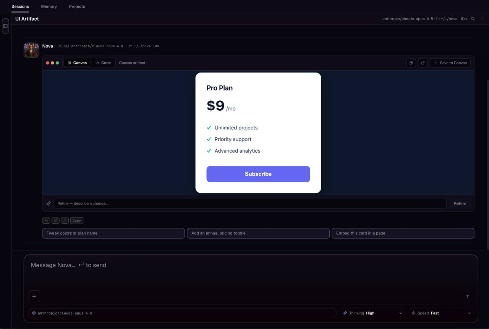
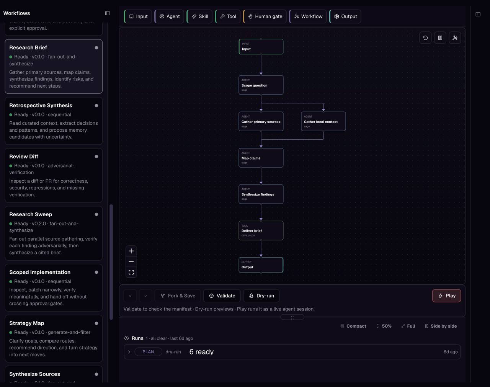

<div align="center">

# 🕯️ Coven Cave

**The desktop control room for your OpenCoven familiars.**

Chat with familiars, orchestrate local agent sessions, triage GitHub, track
tasks, browse memory and libraries, and hand the whole thing off to your phone —
all from one native app.

[](https://github.com/OpenCoven/coven-cave/releases/latest)
[](#install)
[](https://tauri.app)
[](https://nextjs.org)
[](#license)

[**Install**](#install) · [**Features**](#what-it-does) · [**Architecture**](#architecture) · [**Development**](#development) · [**FAQ**](#faq)



</div>

---

## What is Coven Cave?

Coven Cave is the **desktop and mobile home for OpenCoven**. Where OpenCoven
gives you a coven of AI *familiars* — specialized agents for code, research,
social, memory, and strategy — Coven Cave is the room you sit in to talk to
them, watch them work, and steer the work when it matters.

It runs as a **native app** (not a browser tab): a Next.js + React interface
packaged with **Tauri** for macOS, Windows, and Linux, plus a **native SwiftUI
iOS client**. Because it's native, it can do things a web page can't — spawn
local terminal and browser panes, drive local agent sessions through a sidecar,
persist state offline, and hand a live session off to your phone over Tailscale.

> **In one line:** OpenCoven is the coven; Coven Cave is where you meet it.

---

## What it does

- **💬 Chat with familiars** — Talk to any OpenCoven familiar and route work
  through local agent sessions, with multi-session coordination when several
  familiars are working at once.
- **🗂️ Track work** — Manage tasks on the Board and Gantt surfaces, with bulk
  edits and undo. Browse reminders, calendars, and daily/retro reports.
- **🧠 Memory & libraries** — Browse project sessions, local libraries, the
  knowledge vault, and marketplace packages in one place.
- **🐙 GitHub triage** — Review GitHub activity, PRs, and issues inline and feed
  them straight into familiar work.
- **🖥️ Local surfaces** — Launch desktop-local **terminal** and **browser**
  panes through the Cave sidecar, right inside the app window.
- **📱 Mobile handoff** — Hand the app off to a phone over **Tailscale**, or run
  the dedicated native iOS client with its own chat, code, tasks, and feed tabs.
- **⚙️ Workflows & automations** — Run and inspect OpenCoven workflows,
  automations, and marketplace-seeded catalog data.

<div align="center">


</div>

---

## Install

### macOS (Homebrew — recommended)

Install from the [OpenCoven tap](https://github.com/OpenCoven/homebrew-tap):

```bash
brew install --cask opencoven/tap/coven-cave
```

The cask ships the same **signed + notarized** per-architecture DMG as the
release pipeline and stays current automatically.

### macOS / Windows / Linux (direct download)

Grab the latest desktop build from the releases page:

**→ https://github.com/OpenCoven/coven-cave/releases/latest**

Release assets include macOS, Windows, and Linux builds plus update metadata and
checksums.

### iOS

The iOS client ships through **TestFlight**. See
[`apps/ios/CovenCave/README.md`](apps/ios/CovenCave/README.md) for the native
client and widget notes.

---

## Architecture

Coven Cave is a **web UI in a native shell**. The React/Next.js frontend renders
every surface; the Tauri (Rust) shell gives it native powers — windows, a
sidecar for local agent sessions, and OS-level terminal/browser/speech
integration.

```
┌──────────────────────────────────────────────────────────────┐
│                         Coven Cave                            │
│                                                              │
│   ┌────────────────────────┐      ┌───────────────────────┐  │
│   │   Frontend (src/)      │      │  Native shell         │  │
│   │   Next.js 16 · React 19│◀────▶│  (src-tauri/, Rust)   │  │
│   │   Tailwind 4 · TS      │ IPC  │  · window & updater   │  │
│   │                        │      │  · pty terminal       │  │
│   │  Surfaces:             │      │  · browser pane       │  │
│   │  chat · board · gantt  │      │  · speech             │  │
│   │  familiars · settings  │      │  · sidecar archive    │  │
│   │  github · libraries    │      └───────────┬───────────┘  │
│   │  reminders · workflows │                  │              │
│   └───────────┬────────────┘                  │              │
│               │                               ▼              │
│               │                    ┌───────────────────────┐ │
│               └───────────────────▶│  Cave sidecar         │ │
│                  local API routes  │  local agent sessions │ │
│                                    └───────────────────────┘ │
└──────────────────────────────────────────────────────────────┘
              ▲                                    ▲
              │ Tailscale handoff                  │ TestFlight
              ▼                                    ▼
     ┌──────────────────┐                 ┌──────────────────┐
     │ Browser mobile   │                 │ Native iOS       │
     │ dogfooding       │                 │ (apps/ios)       │
     └──────────────────┘                 └──────────────────┘
```

### Tech stack

| Layer          | Technology                                             |
| -------------- | ------------------------------------------------------ |
| UI framework   | **Next.js 16**, **React 19**, **TypeScript**           |
| Styling        | **Tailwind CSS 4** + the Coven design language         |
| Native shell   | **Tauri 2** (Rust) — desktop app + sidecar             |
| Native mobile  | **SwiftUI** iOS client (`apps/ios/CovenCave`)          |
| Mobile handoff | **Tailscale** for LAN/remote device access             |
| Tooling        | **pnpm**, custom Next dev server, Vitest-style tests   |

### Repository layout

| Path            | What lives there                                                        |
| --------------- | ----------------------------------------------------------------------- |
| `src/`          | Next.js app, API routes, React components, shared libraries, sandbox    |
| `src-tauri/`    | Tauri desktop shell + sidecar (Rust: pty, browser, speech, archive)     |
| `apps/ios/`     | Native SwiftUI iOS client and widget targets                            |
| `apps/`         | Additional companion apps (markdown, terminal helpers)                  |
| `docs/`         | Design notes, audits, mobile checklists, workflows, and feature specs   |
| `scripts/`      | Build, mobile, test, packaging, and maintenance helpers                 |
| `marketplace/`  | Seeded OpenCoven marketplace catalog data                               |
| `workflows/`    | OpenCoven workflow definitions                                          |

For deeper design context, start with [`docs/golden-paths.md`](docs/golden-paths.md),
[`docs/coven-design-language.md`](docs/coven-design-language.md), and
[`docs/multi-session-coordination.md`](docs/multi-session-coordination.md).

---

## Development

### Requirements

- **Node.js 22+**
- **pnpm 10+**
- **Rust** and Cargo
- Tauri desktop prerequisites for your platform
- **Xcode + XcodeGen** for iOS work

### Setup

```bash
pnpm install
```

### Run the web app

```bash
pnpm dev
```

Starts the custom Next.js development server.

### Run the native desktop shell

```bash
bash scripts/dev-app.sh   # or: pnpm dev:app
```

Run the wrapper **in the foreground** and leave the terminal attached; stop it
with `Ctrl-C`. Detached runs can exit without leaving useful Tauri logs, so
foreground startup is the reliable way to confirm the app launched.

The wrapper picks the first free loopback port in `3000..3010` (if `3000` is
taken, e.g. by Docker, it uses `3001`), reuses or starts the dev server, writes
a temporary Tauri config pointing `devUrl` at the real port, and runs
`tauri dev`. Force a port with `PORT=3007 bash scripts/dev-app.sh`.

Expected early output:

```text
[dev:app] port 3001 is free
[dev:app] starting dev server on 3001
Running BeforeDevCommand (`PORT=3001 pnpm dev`)
> Ready on http://127.0.0.1:3001
Running DevCommand (`cargo run --no-default-features --color always --`)
```

<details>
<summary><strong>Startup looks stuck? Diagnose it here</strong></summary>

- **First launch is slow by design.** Cargo downloads and compiles Rust crates
  before the window appears. `Compiling ...` lines are progress, not a hang.
- **No `port ... is free` line + an error** → every port in `3000..3010` is
  occupied. Free one or pass an explicit `PORT=`.
- **Stuck before `> Ready on ...`** → the Next dev server. Check the wrapper's
  terminal for Next/Node errors.
- **Stuck after `Running DevCommand` with no Cargo output** → the Rust
  toolchain. Verify `cargo --version` and the Tauri prerequisites.

</details>

### Build

```bash
pnpm build
```

`pnpm build` also runs the generated icon/PWA/sandbox setup before the Next.js
and server builds.

### Mobile & iOS

```bash
pnpm mobile:tailscale          # browser-based mobile dogfooding over Tailscale
pnpm mobile:tailscale:native   # native iOS development
```

The native SwiftUI app has its own notes in
[`apps/ios/CovenCave/README.md`](apps/ios/CovenCave/README.md).

---

## Verification

Run the checks that match what you changed:

```bash
pnpm typecheck          # TypeScript
pnpm test:app           # app/component tests
pnpm test:api           # API route tests
pnpm test:mobile        # mobile/iOS logic tests
pnpm test:e2e           # end-to-end
pnpm check:tests-wired  # ensure new tests are registered
```

---

## Contributing

`main` is **protected** — every change goes through a short-lived branch and a
pull request. Use a worktree:

```bash
git worktree add -b <branch> .worktrees/<branch> origin/main
cd .worktrees/<branch>
```

Make the branch PR-shaped before opening: a scoped diff, relevant local
verification, and a clear summary of what changed. After merge, delete the
remote branch and remove the local worktree.

- **Releases, TestFlight uploads, and updater validation start from clean
  `main`.**
- See [`AGENTS.md`](AGENTS.md) and [`CLAUDE.md`](CLAUDE.md) for the workflow
  notes coding agents follow, and
  [`docs/workflows/branching.md`](docs/workflows/branching.md) for branch/release
  hygiene.

---

## FAQ

<details>
<summary><strong>How is Coven Cave different from OpenCoven?</strong></summary>

OpenCoven is the platform and the coven of familiars. Coven Cave is the **native
client** you use to interact with them — the control room. You can think of
OpenCoven as the engine and Coven Cave as the cockpit.

</details>

<details>
<summary><strong>Do I need to build from source to use it?</strong></summary>

No. Install the signed desktop build via Homebrew (`brew install --cask
opencoven/tap/coven-cave`) or download it from the
[releases page](https://github.com/OpenCoven/coven-cave/releases/latest).
Building from source is only needed for development.

</details>

<details>
<summary><strong>Why is it a native app instead of a website?</strong></summary>

Native capabilities: local terminal and browser panes, a sidecar that drives
local agent sessions, offline-capable state, OS-level speech, auto-updates, and
device handoff. A browser tab can't spawn a local shell or hold a persistent
agent session the way the Tauri shell can.

</details>

<details>
<summary><strong>What is the "sidecar"?</strong></summary>

The Cave sidecar is the local companion process the Tauri shell manages. It
backs the desktop-local surfaces (terminal, browser) and hosts local agent
sessions so familiar work can run on your machine.

</details>

<details>
<summary><strong>How does mobile handoff work?</strong></summary>

Two paths. For quick dogfooding, `pnpm mobile:tailscale` exposes the web app to
your phone over **Tailscale**. For a first-class experience, the native SwiftUI
iOS client (shipped via TestFlight) has its own chat, code, tasks, and feed
tabs.

</details>

<details>
<summary><strong>Which platforms are supported?</strong></summary>

Desktop: **macOS, Windows, and Linux**. Mobile: **iOS** (native client) and any
phone browser via Tailscale.

</details>

<details>
<summary><strong>The desktop app seems stuck on first launch — is it broken?</strong></summary>

Almost always no. The first `dev:app` or first install compiles Rust crates,
which can take several minutes. `Compiling ...` output is progress. See the
[startup diagnostics](#run-the-native-desktop-shell) above.

</details>

<details>
<summary><strong>Can I run several familiars at once?</strong></summary>

Yes. Coven Cave supports multiple concurrent agent sessions with coordination
across them — see [`docs/multi-session-coordination.md`](docs/multi-session-coordination.md).

</details>

---

## License

Coven Cave is licensed under **`MIT OR AGPL-3.0-only`**. See [`LICENSE`](LICENSE),
[`LICENSE-MIT`](LICENSE-MIT), and [`LICENSE-AGPL`](LICENSE-AGPL).

<div align="center">

**Part of [OpenCoven](https://github.com/OpenCoven)** · Knowledge is Freedom

</div>
