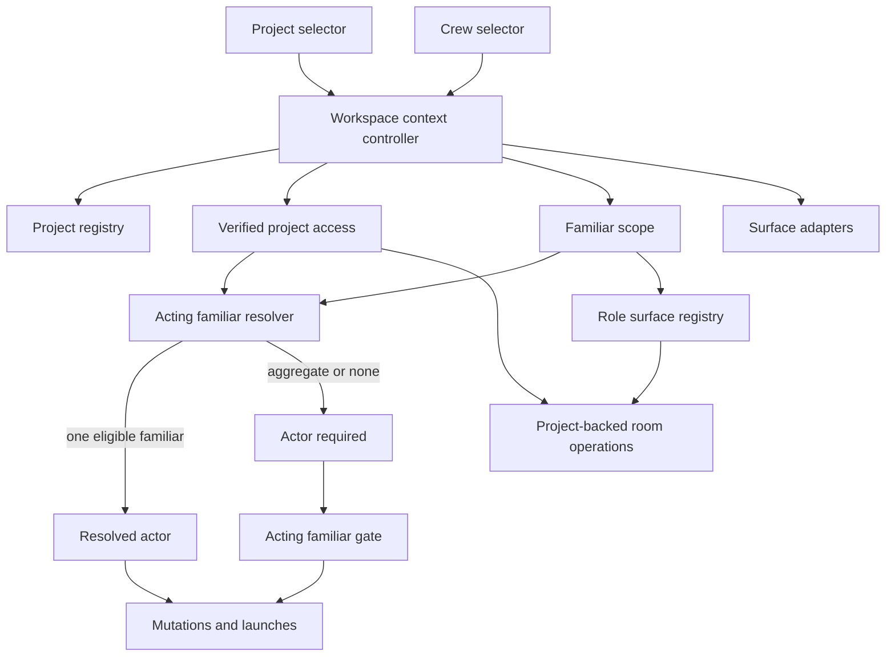

# Project-primary hybrid navigation context

**Status:** approved
**Date:** 2026-08-18
**Bead:** cave-gxntm
**Surfaces:** shell navigation, Home, Chat, Board, Calendar, Queue, Code, GitHub, role rooms, desktop, mobile, and native iOS

## Goal

Make project context the Cave's primary operational navigation scope without
erasing familiar identity or allowing ambiguously attributed actions.

The interaction model is:

> **Project chooses the workspace. Familiar scope chooses the crew. One acting
> familiar executes an action.**

This is an information-architecture change, not a selector replacement.
Projects organize the work. Familiars retain ownership of identity, presence,
memory, roles, runtime defaults, permissions, and action attribution.

## Problem

The current shell is familiar-first:

- `workspace.tsx` owns a single or multi-familiar scope in `scopeIds`; a
  single selected member becomes `activeId`.
- familiar changes can restore that familiar's last surface;
- sessions, task counts, calendar context, Chat, memory, and multiple detail
  surfaces consume the active familiar or familiar set;
- `SidebarRailHeader` places `FamiliarSwitcher` above primary navigation;
- role rooms are resolved from familiar roles.

Project context is already important but fragmented:

- `useProjects()` supports the operator-wide registry and familiar-accessible
  project lists;
- Home, Chat, Queue, Projects, Board creation, Code, and other surfaces own
  separate project selections or persistence;
- project registration and familiar access are distinct;
- registered projects and session-derived project groupings are not canonical
  on every surface.

As a result, an operator often reselects the same project across surfaces while
the global shell foregrounds a familiar even when the operator's real intent is
to stay inside one body of work.

## Decision

Adopt **project-primary, familiar-retained navigation**:

1. The first shell context row selects a project workspace.
2. The second row selects the visible project crew or one acting familiar.
3. Familiar-attributed actions require one verified eligible actor.
4. Role room visibility remains familiar-derived.
5. Global surfaces explicitly ignore project context or provide their own
   clearly labeled local filter.

Do not remove familiar selection, infer a grant from project selection, or
silently choose the first eligible familiar.

## Approaches considered

### A. Replace familiar selection with project selection

This provides the simplest visible hierarchy but hides the actor, permissions,
identity, role rooms, memory scope, and presence. It creates ambiguity rather
than removing complexity.

**Rejected.**

### B. Keep familiar selection primary and add project beneath it

This has the lowest migration cost and can be a safe transitional state. It
leaves projects subordinate, however, and does not solve repeated project
selection across work surfaces.

**Not the destination.**

### C. Make project primary and crew/actor secondary

This gives the Cave a stable workspace model, supports multi-familiar
collaboration, and retains familiar identity and attribution. It requires a
two-dimensional context model and staged migration.

**Chosen.**

### D. Change the primary selector by surface

Each surface could foreground its natural object, but navigation controls would
change meaning between rooms. Local secondary filters remain valid; the shell
context must stay stable.

**Rejected as the shell model.**

## Context model

### Project scope

```ts
type ProjectScope =
  | { kind: "all-projects" }
  | { kind: "project"; projectId: string };
```

`All projects` is the operator overview. A project-bound mutation requires a
specific project.

`No project` is not a global shell scope. It remains a launch- or session-level
choice for work without a project root. A global no-project workspace would
misleadingly group unrelated work.

### Familiar scope

```ts
type FamiliarScope =
  | { kind: "all-eligible" }
  | { kind: "selected"; familiarIds: ReadonlySet<string> };
```

For a selected project, `all-eligible` is labeled **Project crew** and contains
only familiars with verified access. Under All projects, it retains today's
**All familiars** meaning.

The familiar control continues to own presence, needs-reply signals, identity,
role labels, profile management, and multi-selection.

### Acting familiar

```ts
type ActingFamiliar =
  | { kind: "resolved"; familiarId: string }
  | { kind: "required" };
```

One selected eligible familiar resolves the actor. Aggregate scopes may browse,
compare, and triage. Before a mutation, session launch, model selection,
runtime selection, or role-bound action, the Cave must either:

1. derive an actor already named by the object being acted on; or
2. ask the operator to choose an eligible familiar.

There is no first-member fallback.

## Invariants

1. Selecting a project never creates or changes a grant.
2. A stale project, grant, familiar, or session response never paints into a
   newer scope.
3. Project-scoped browsing is the intersection of project scope and familiar
   scope.
4. Familiar-attributed mutations require one verified eligible actor.
5. Role room visibility derives from familiar roles, not project grants.
6. Project access authorizes project-backed operations inside a visible room;
   it does not unlock the room.
7. Project and familiar changes preserve the current surface when that surface
   supports the resulting context.
8. Explicit navigation changes rooms; context selection does not restore an
   unrelated room as a side effect.
9. A deleted or unauthorized context produces an honest blocked or aggregate
   state, never a silent substitute.

## Reconciliation

### Selecting a project

1. Set the new project scope.
2. Load its verified eligible familiar set.
3. Retain currently selected familiars that remain eligible.
4. If one retained familiar remains, resolve it as the actor.
5. If multiple remain, keep the crew scope and require an actor only when an
   action needs one.
6. If none remain, use Project crew aggregate scope and mark the actor required.
7. Preserve the current surface if it supports projects; otherwise open the
   project overview.

Project selection narrows the crew. It never grants access or silently selects
an actor.

### Selecting familiar scope

Within a selected project, list only verified eligible familiars. Keep direct
paths to project access management and Familiar Studio, but do not allow an
ineligible familiar to become the acting familiar.

Within All projects, retain the existing all, single, and multi-familiar
semantics.

### Access changes

If the actor loses access:

- invalidate the actor immediately;
- keep the project visible in a blocked state;
- explain that the familiar no longer has access;
- offer another eligible familiar, access management, or All projects;
- do not choose a different familiar or project automatically.

### Project deletion or unavailability

Return to All projects, preserve valid familiar scope where possible, and
announce the scope change. Do not select the first remaining project.

### Deep links

Resolve project context before an optional familiar id. Accept the familiar only
when currently eligible. Invalid context lands in an aggregate or blocked state
instead of substituting a different project or familiar.

## Surface ownership

### Project-primary

These surfaces use the main project scope by default:

- Home;
- Chat browsing and new-chat launch;
- Board and Gantt;
- Calendar work with project affinity;
- Queue;
- Code and project files;
- GitHub work;
- terminal and browser launches originating from project work.

A historical session or local draft may temporarily carry different project
context, but the override must be visible.

### Familiar-primary

These remain principally keyed by familiar identity:

- Familiar Studio;
- identity, soul, roles, skills, runtime defaults, and analytics;
- familiar-owned memory inspection;
- role rooms.

A role room may consume the selected project as secondary operational context,
but project selection does not determine whether the room exists.

### Global

These do not implicitly filter by the selected project:

- Settings;
- Marketplace;
- Inbox and notifications;
- Grimoire and global knowledge;
- coven-wide dashboards.

They may expose an explicit local project filter when supported by their data.
When the main project context is irrelevant, the shell should present it as
inactive or ignored rather than silently filtering only part of the surface.

## Desktop navigation

### Expanded rail

```text
┌──────────────────────────────────────┐
│  Home                     Chat       │
│                                      │
│  ◈  Coven Cave                    ⌄  │  Project workspace
│  ●  Cody · Project crew           ⌄  │  Crew / acting familiar
│                              [ New ] │
│  ──────────────────────────────────  │
│  Overview                            │
│  Sessions                         8  │
│  Tasks                           12  │
│  Calendar                         3  │
│  Code                                │
│                                      │
│  Rooms                               │
│  Coding Desk                         │
│  Review Deck                         │
│                                      │
│  Settings                            │
└──────────────────────────────────────┘
```

The project row is primary: project avatar, name, and disclosure. The crew row
is visually quieter but persistent. New uses both contexts and opens an acting
familiar gate when the crew is aggregate.

### All-projects state

```text
┌──────────────────────────────────────┐
│  ▦  All projects                  ⌄  │
│  ✦  All familiars                 ⌄  │
│                              [ New ] │
└──────────────────────────────────────┘
```

A project-bound creation asks for a project and then an actor. A genuinely
global action proceeds without either when its own contract permits it.

### Collapsed rail

```text
┌──────┐
│  ◈   │  project avatar
│  ●   │  acting familiar / crew stack
│  ✎   │  new
│  ─   │
│  ⌂   │
│  ◫   │
│  ✓   │
└──────┘
```

Hover-peek expands both context rows together. Aggregate crew uses a stack or
sparkle glyph and must not impersonate one familiar.

## Selector popovers

### Project

```text
Switch project
[ Search projects…                  ]

Recent
  ◈ Coven Cave              Full
  ◇ Coven Code              Full

All projects
──────────────────────────────────────
Add project…
Manage projects…
```

Reuse the existing project-picker behavior and primitives:

- filtering and frecency;
- project avatar, root, and access label;
- add-project flow;
- loading, empty, and error states;
- keyboard navigation, Escape, outside-click, and focus return.

### Crew

```text
Project crew
──────────────────────────────────────
✓ Cody             Coding · Online
  Nova             Orchestration
  Salem            Research

  Select multiple
  Manage project access…
  Open Familiar Studio…
```

Show only verified eligible familiars for a selected project. Preserve presence
and response-needed indicators. Keep access management explicit and separate
from selection.

## Mobile and native iOS

Use one compact top-bar context control:

```text
[ ◈ Coven Cave · Cody ⌄ ]                  [ New ]
```

Open a single context sheet with two persistent sections:

1. Project
2. Crew / acting familiar

Both resolved values remain visible before dismissal. This preserves the
desktop model without forcing two full selectors into narrow chrome. Native iOS
must implement the same state and reconciliation contract even when it uses
native sheet and navigation components.

## Architecture



### Workspace context controller

Own:

- project scope;
- familiar scope;
- acting-familiar resolution;
- reconciliation and persistence;
- accessible announcements.

Expose an immutable context plus commands such as `selectProject`,
`selectFamiliarScope`, and `requireActingFamiliar`. Compose existing project,
grant, familiar, and role data; do not mutate grants.

### Workspace context switcher

Presentational shell control containing:

- `ProjectContextTrigger`, backed by project-picker primitives;
- `CrewContextTrigger`, backed by familiar-switcher behavior;
- the shared New action;
- expanded, collapsed, hover-peek, and mobile variants.

It does not fetch data or decide access.

### Project eligibility adapter

Resolve the selected project's verified eligible familiar set. Fail closed
during scope changes. A previous project's crew must not remain visible during
loading or failure.

### Acting familiar gate

Provide one reusable boundary for New chat, task creation, dispatch, model and
runtime selection, and other familiar-attributed mutations. Render only when
the action cannot derive a unique eligible actor.

### Surface adapters

Every migrated surface declares whether it:

- filters by project;
- filters by familiar scope;
- requires an actor for mutations;
- ignores project context.

Do not let each surface invent independent selector semantics.

## Persistence

Use versioned keys:

```text
cave:workspace:project-scope:v1
cave:workspace:familiar-scope-by-project:v1
```

Remember familiar scope per project. Validate every restored member against the
fresh eligible set before rendering.

Do not initially make last-surface persistence project-specific. Context changes
preserve the current compatible surface. Add project-specific surface memory
only if observed use shows a recurring navigation problem.

## Loading, empty, and error behavior

- Project and eligibility requests use scope keys and generation guards.
- Mask retained data synchronously when the requested scope changes.
- While project eligibility loads, keep project identity visible but disable
  actor-required actions.
- When no familiar has project access, show an `EmptyState` that explains the
  missing crew and links to access management.
- When eligibility fails, show `ErrorState` with Retry. Do not show the
  operator-wide roster as if it were eligible.
- If the selected project disappears, announce the change and return to All
  projects.
- If one surface temporarily overrides shell project context, show both values
  and a clear action to return to the workspace project.

## Accessibility

- Both selectors are native buttons with explicit current-value labels.
- Expanded controls expose `aria-haspopup`, `aria-expanded`, and their dialog
  relationship.
- Project and crew changes are announced through `useAnnouncer()`.
- The New action names missing context instead of appearing inert.
- All selector operations are keyboard-complete and return focus to the trigger.
- Presence and eligibility never rely on color alone.
- Collapsed icons retain complete accessible names and tooltips.
- Mobile sheets use focus containment and restore focus on close.
- Motion follows the shared duration tokens and collapses under
  `prefers-reduced-motion`.

## Design-system constraints

- Reuse `ProjectPicker`, `FamiliarSwitcher`, `Popover`, `Button`, `EmptyState`,
  `ErrorState`, and existing project/familiar avatars.
- Introduce no hardcoded colors, off-grid spacing, raw text sizes, or custom
  focus treatments.
- Project is the visual primary context; familiar presence continues to use
  `--accent-presence`.
- Preserve one primary CTA per surface. The selectors are context controls, not
  accent-filled calls to action.
- Copy stays utilitarian: “Switch project,” “Project crew,” “Choose familiar,”
  “Manage project access…”.

## Migration

This is a staged architecture change, not one visual pull request.

### Stage 1: Context contract and Home pilot

- Add pure project/crew/actor reconciliation logic and tests.
- Add shell-owned project scope and the hybrid context switcher.
- Migrate Home and new-chat launch.
- Mark non-migrated surfaces as not project-filtered.

### Stage 2: Work surfaces

- Migrate Chat browsing, Board, Queue, Calendar, Code, and GitHub.
- Connect navigation history, command palette, deep links, and New actions.
- Remove local project persistence only after its surface adopts shell context.

### Stage 3: Roles and aggregate behavior

- Apply role-room and acting-familiar-gate contracts.
- Audit global surfaces for explicit ignore/filter behavior.
- Verify access revocation, project deletion, and stale-response recovery.

### Stage 4: Platform parity

- Implement the compact mobile context sheet.
- Bring the same contract to native iOS.
- Verify desktop expanded, collapsed, hover-peek, mobile, and native behavior.

## Testing

### Pure state tests

Cover:

- project selection retaining eligible familiar members;
- zero, one, and multiple retained members;
- actor resolution and required state;
- access revocation;
- project deletion;
- restored per-project familiar scope;
- invalid deep links;
- All projects behavior;
- no first-project or first-familiar fallback.

### Integration tests

Verify:

- stale project and eligibility responses cannot cross scope;
- every actor-required mutation passes through the shared gate;
- role rooms remain familiar-derived;
- project selection does not grant access;
- current compatible surface survives context changes;
- global surfaces do not partially filter;
- local overrides are visibly identified;
- command palette and navigation history round-trip context.

### UI and platform checks

Verify:

- expanded and collapsed desktop rail;
- hover-peek parity;
- narrow desktop and mobile sheet;
- native iOS context sheet;
- keyboard-only operation and focus return;
- screen-reader labels and announcements;
- all theme and mode combinations;
- reduced motion;
- loading, empty, blocked, and error states.

## Success measures

1. Switching projects updates every migrated project-primary surface without
   changing rooms unexpectedly.
2. A retained familiar remains selected only while eligible.
3. Aggregate crew views cannot perform ambiguously attributed mutations.
4. Project selection never grants access or substitutes another project.
5. Role rooms remain visible according to familiar roles.
6. The project and actor used by every launch or mutation are visible before
   confirmation.
7. Stale project, grant, familiar, and session responses cannot cross scope.
8. Desktop, collapsed, hover-peek, mobile, keyboard, screen-reader, and native
   iOS flows expose the same context.
9. Moving among Home, Chat, Board, Queue, Calendar, and Code requires fewer
   repeated project selections without increasing blocked launches or
   correction actions.

## Non-goals

- Removing familiar identity or Familiar Studio.
- Treating project access as role-room authorization.
- Automatically granting a selected project to a familiar.
- Creating a global No project workspace.
- Replacing every local project selector in the first delivery.
- Making every global knowledge or settings item project-owned.
- Adding project-specific last-surface persistence before observed need.
- Implementing the feature in this specification change.
